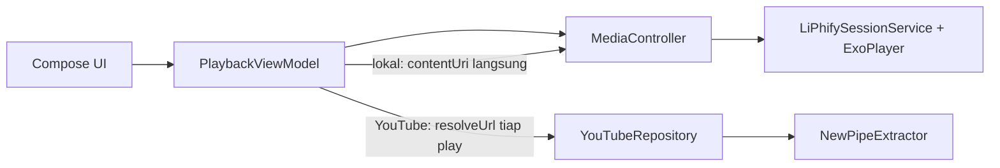
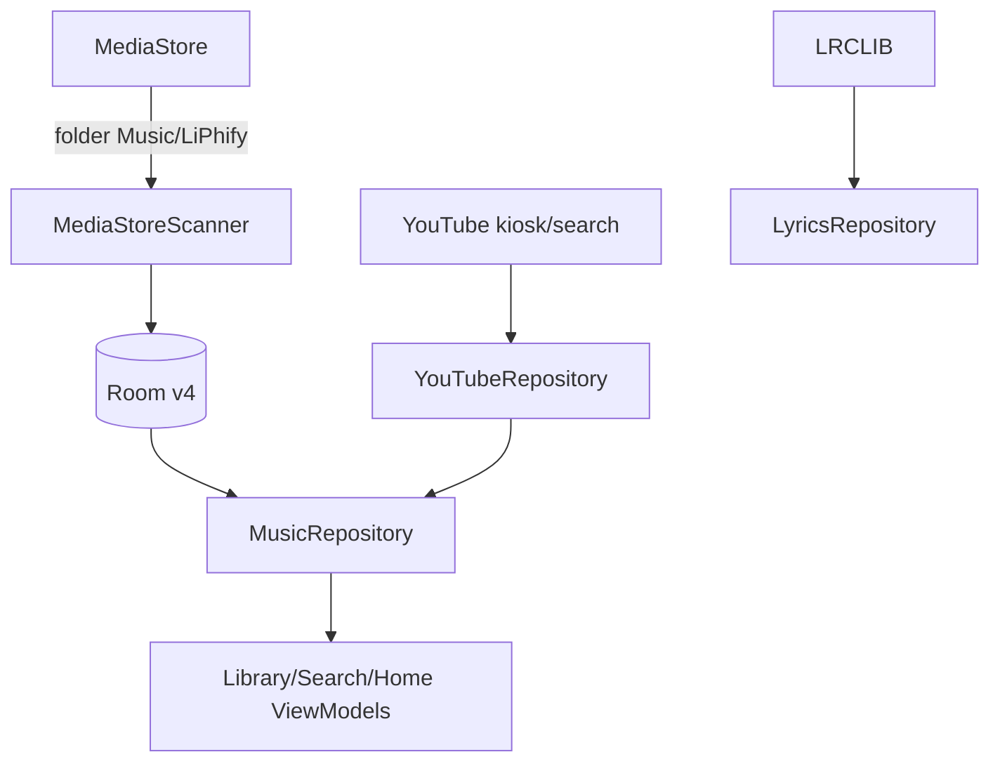

# Arsitektur LiPhify

Single-module, layer per package. Aturan emas: **UI/playback tidak pernah
menyentuh NewPipeExtractor langsung** — semua lewat `data/youtube/`.

## Alur putar (kasus utama)

- `PlaybackSource` sealed: `Local(uri)` | `YouTube(videoId)`. Queue/Now
  Playing pegang ini + metadata umum — source transparan ke UI.
- Tap lagu = putar item itu LANGSUNG, sisa antrian di-resolve di belakang
  (URL YouTube time-limited; resolve di depan = lambat + basi).
- Putus controller (service di-kill OS) = reconnect otomatis max 3x, lalu
  pesan jelas. Aksi sebelum connect = antre (max 20), bukan hilang diam-diam.
- Gagal putar (`onPlayerError`) = snackbar + auto-skip ke lagu berikut.
- Queue persist di Room, restore tanpa autoplay; track lokal dimuat ulang
  ke controller saat connect (YouTube di-resolve saat di-tap).

## Alur data

- **Scanner**: selection `RELATIVE_PATH LIKE 'Music/LiPhify/%' (+ '=' varian,
  `COLLATE NOCASE`) + tolak ringtone/notif/alarm + durasi/size minimum.
  Multi-volume (SD card), single-flight `Mutex`, kolom defensif
  (`getColumnIndex`, bukan OrThrow). `rowKey = contentUri` (PK unik per volume).
- **YouTube**: kiosk `Trending` → fallback 3 query paralel; search pakai
  filter `MUSIC_SONGS`; hanya `StreamInfoItem` (playlist/channel dibuang);
  thumb HD `img.youtube.com/vi/{id}/sddefault.jpg`; `catch Throwable`
  (tapi `CancellationException` SELALU rethrow); timeout 15–25 dtk.
- **DB v4**, migrasi eksplisit 1→2→3→4, **tanpa destructive-upgrade**.
  Tabel: `tracks` (library), `yt_cache`, `playlists` + `playlist_tracks`,
  `history`, `queue`. Playlist "Favorit" otomatis = backend tombol ☆.
- **Lirik**: `LyricsRepository` (LRCLIB) → `PlaybackViewModel.loadLyrics()`
  → `LyricsState` (Idle/Loading/Success/NotFound) → panel synced-highlight.

## Batas NewPipe (rapuh by design)

- YouTube ubah struktur = extractor bisa mati sampai upstream patch.
  Semua call terbungkus → pesan "Gagal ambil data…", fitur lokal tetap jalan.
- Pin eksak `v0.26.5` (JitPack). Bump = uji `assembleRelease` (debug lolos
  ≠ rilis lolos — R8/Rhino).
- Downloader OkHttp: timeout connect 15 dtk / read 60 dtk / call 90 dtk +
  User-Agent browser (bot-guard).

## UI ringkas

Scaffold: 3 tab (Home/New/Library) + search bulat 44dp, pill Haze
(`hazeChild` WAJIB `backgroundColor` eksplisit — pernah crash 3x),
mini-player floating + hairline, Now Playing overlay (Back = collapse).
Design system: `Glass.kt` (kaca + rim-light + glow) + `Motion.kt`
(`pressable`, `appear` stagger). Detail per-inci: [`UI.md`](../UI.md).
